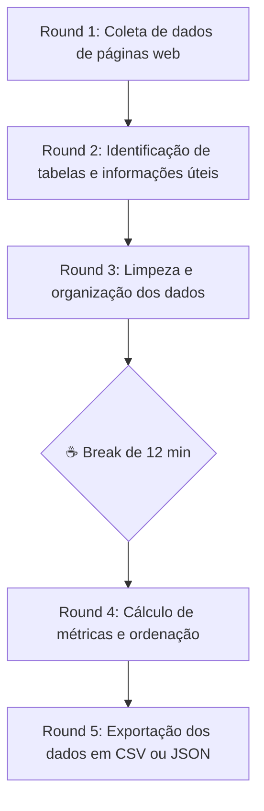

# II Dojo de Código - GruPy Pará: Web Scraping com Python 🕸️⚽

Bem-vindo ao repositório do **II Dojo de Código do GruPy Pará**! 

Nesta edição, nosso foco será prático e voltado para **Web Scraping (Coleta Automatizada de Dados)** usando Python. Vamos raspar uma tabela com dados do Campeonato Paraense (Parazão), realizar a limpeza e tratamento desses dados, computar métricas esportivas (Pontos, Saldo de Gols, Aproveitamento), ordenar a tabela sob os critérios oficiais de desempate e exportar o resultado final em formatos estruturados (JSON e CSV).

---

## 📌 O que é um Coding Dojo?

O **Coding Dojo** é um encontro colaborativo onde pessoas interessadas em programação se reúnem para praticar e melhorar suas habilidades de desenvolvimento de forma segura e divertida.

* **Foco no Aprendizado:** Não há competição. O objetivo é a troca de conhecimentos, refatoração de código e boas práticas (como TDD, Clean Code e modularização).
* **Ambiente Seguro:** Erros não são punidos. Pelo contrário: errar rápido ajuda a aprender mais rápido.
* **Dinâmica Randori:**
  * Um computador central é projetado para todos verem.
  * Dois participantes sentam-se à frente: o **Piloto** (quem digita e explica o raciocínio) e o **Copiloto** (quem apoia, dá ideias e ajuda a evitar erros).
  * A plateia acompanha em silêncio (só ajuda quando solicitada pelos pilotos).
  * **Rodadas de Rotação (Ciclos de Teclado):** Com **105 minutos** de programação ativa, definimos as seguintes rodadas recomendadas conforme o tamanho do grupo:
    * **Para grupos de 6 a 10 pessoas (Turnos de 7 min):** Total de **15 rodadas de rotação**. (8 rodadas no Bloco 1 + 7 rodadas no Bloco 2). Ideal para maximizar o tempo de cada um no teclado.
    * **Para grupos de 10 a 20 pessoas (Turnos de 5 min):** Total de **21 rodadas de rotação**. (12 rodadas no Bloco 1 + 9 rodadas no Bloco 2). Garante que todos participem ao menos uma vez como Piloto ou Copiloto.
  * A cada ciclo (5 ou 7 minutos), soa o alarme: o Piloto volta para a plateia, o Copiloto assume o teclado como Piloto, e uma pessoa da plateia assume o papel de Copiloto.

---

## ⏱️ Cronograma Oficial (09:00 - 11:30)

O evento foi estruturado de forma milimétrica para começarmos pontualmente às 09:00 e finalizarmos às 11:30, contando com uma **folga de 12 minutos** para coffee-break e networking.

| Horário | Atividade | Duração | Descrição |
| :--- | :--- | :---: | :--- |
| **09:00 - 09:15** | **Abertura & Introdução** | 15 min | Boas-vindas, explicação da dinâmica Randori, apresentação do desafio e divisão de papéis. |
| **09:15 - 09:35** | **Round 1: Coleta de dados de páginas web** | 20 min | Inicialização do ambiente virtual (`venv`), instalação de dependências e disparo da primeira requisição HTTP para obter o HTML. |
| **09:35 - 09:55** | **Round 2: Identificação de tabelas e informações úteis** | 20 min | Mapeamento da estrutura DOM da tabela oficial do campeonato usando BeautifulSoup. |
| **09:55 - 10:15** | **Round 3: Limpeza e organização dos dados** | 20 min | Iteração sobre as linhas da tabela, captura e higienização dos dados e conversão para tipos corretos. |
| **10:15 - 10:27** | **☕ Intervalo / Break** | **12 min** | **Folga para café, descanso mental e bate-papo entre os participantes.** |
| **10:27 - 10:52** | **Round 4: Cálculo de métricas (pontos, saldo de gols e aproveitamento)** | 25 min | Cálculo de Pontos, Saldo de Gols e Aproveitamento (%) e ordenação da classificação sob critérios oficiais de desempate. |
| **10:52 - 11:12** | **Round 5: Exportação dos dados em CSV ou JSON** | 20 min | Escrita dos dados processados em arquivos físicos JSON e CSV usando codificação UTF-8. |
| **11:12 - 11:30** | **Retrospectiva & Encerramento** | 18 min | Feedback em grupo (o que deu certo / o que melhorar), fechamento das refatorações e foto oficial. |

---

## 🏗️ Detalhamento dos Rounds do Desafio



### 🔹 Round 1: Coleta de dados de páginas web (09:15 - 09:35)
* **Objetivo:** Criar a estrutura do ambiente virtual e conseguir obter o HTML bruto de uma URL ou de arquivo local.
* **Foco:** Biblioteca `requests`.
* **Atividades:**
  1. Ativar o ambiente virtual e instalar dependências via `pip install -r requirements.txt`.
  2. Implementar a função `obter_html` em `src/scraper.py`.
  3. Fazer com que o script leia de forma inteligente: se receber uma URL (`http...`), faz uma chamada de rede; se receber um caminho local, lê o arquivo `static/parazao.html` diretamente (garantindo que o dojo funcione perfeitamente mesmo offline).
  4. Rodar o teste correspondente: `PYTHONPATH=. pytest tests/test_scraper.py -k test_obter_html_local`.

### 🔹 Round 2: Identificação de tabelas e informações úteis (09:35 - 09:55)
* **Objetivo:** Inspecionar a estrutura do documento e mapear a tabela de estatísticas.
* **Foco:** Biblioteca `beautifulsoup4`.
* **Atividades:**
  1. Abrir `static/parazao.html` no navegador e inspecionar a tabela usando as Ferramentas do Desenvolvedor (F12).
  2. Identificar a tag `table` com o id `tabela-estatisticas`.
  3. Começar a implementar a função `parsear_tabela` em `src/scraper.py`, buscando o elemento correspondente e encontrando o corpo da tabela (`<tbody>`).

### 🔹 Round 3: Limpeza e organização dos dados (09:55 - 10:15)
* **Objetivo:** Varrer cada time da tabela e estruturar suas informações básicas em memória.
* **Foco:** Manipulação de strings, controle de fluxo e casting de tipos.
* **Atividades:**
  1. Concluir a função `parsear_tabela` iterando pelas linhas (`tr`) dentro do `tbody`.
  2. Para cada linha, extrair o texto de cada célula (`td`):
     - **Coluna 1:** Posição (pode ser ignorada nesse momento, pois será recalculada no Round 4)
     - **Coluna 2:** Nome do Time (aplicar `.strip()` para limpar espaços em branco desnecessários)
     - **Colunas 3 a 8:** Jogos, Vitórias, Empates, Derrotas, Gols Pró e Gols Contra.
  3. Converter as estatísticas numéricas extraídas de string para inteiros (`int`).
  4. Rodar o teste correspondente para validar o parsing: `PYTHONPATH=. pytest tests/test_scraper.py -k test_parsear_tabela`.

### 🔹 Round 4: Cálculo de métricas (pontos, saldo de gols e aproveitamento) (10:27 - 10:52)
* **Objetivo:** Processar os dados brutos calculando métricas de classificação esportiva e ordenar os times de forma correta.
* **Foco:** Lógica matemática e ordenação customizada (`sorted()` com `key`).
* **Atividades:**
  1. Implementar a função `calcular_metricas_e_ordenar`.
  2. Para cada dicionário de time na lista, calcular e adicionar as seguintes chaves:
     - `pontos` = $(Vitórias \times 3) + Empates$
     - `saldo_gols` = $Gols\ Pró - Gols\ Contra$
     - `aproveitamento` = $\frac{Pontos}{Jogos \times 3} \times 100$ (arredondado para 1 casa decimal, ex: `76.7`). Tratar divisão por zero se o time não tiver jogos.
  3. Ordenar a tabela final seguindo a prioridade oficial de desempate:
     - **1º critério:** Maior pontuação (`pontos`)
     - **2º critério:** Melhor saldo de gols (`saldo_gols`)
     - **3º critério:** Maior número de vitórias (`vitorias`)
  4. Atribuir a posição final (de 1 a 10) baseada na ordenação obtida.
  5. Validar o algoritmo rodando o teste: `PYTHONPATH=. pytest tests/test_scraper.py -k test_calcular_metricas_e_ordenar`.

### 🔹 Round 5: Exportação dos dados em CSV ou JSON (10:52 - 11:12)
* **Objetivo:** Persistir os dados processados e estruturados em disco.
* **Foco:** Módulos `json` e `csv` nativos do Python.
* **Atividades:**
  1. Implementar a função `exportar_dados`.
  2. Salvar o resultado no formato JSON formatado (`indent=4`) ou em formato de tabela CSV.
  3. **Atenção:** Utilizar a codificação `utf-8` para garantir que acentos típicos (como em *Caeté* ou *Tuna Luso*) e caracteres especiais sejam gravados perfeitamente.
  4. Validar os arquivos de saída rodando toda a suíte de testes do projeto: `PYTHONPATH=. pytest`.

---

## 🛠️ Instruções de Setup

Para executar o projeto no seu computador:

1. **Clonar o Repositório:**
   ```bash
   git clone https://github.com/grupy-pa/ii-dojo-de-codigo-web-scraping.git
   cd ii-dojo-de-codigo-web-scraping
   ```

2. **Criar e Ativar o Ambiente Virtual:**
   ```bash
   python3 -m venv venv
   source venv/bin/activate  # No Windows: venv\Scripts\activate
   ```

3. **Instalar Dependências:**
   ```bash
   pip install -r requirements.txt
   ```

4. **Rodar a Suíte de Testes (TDD):**
   ```bash
   PYTHONPATH=. pytest
   ```

5. **Executar o Script Principal:**
   ```bash
   python src/scraper.py
   ```

---

## 📧 Modelo de Convocação (E-mail para os Participantes)

```markdown
Assunto: 🕸️ Prepare seu setup! II Dojo de Código GruPy Pará: Web Scraping com Python!

Olá, dev!

Está chegando o II Dojo de Código do GruPy Pará! No próximo sábado, às 09:00 pontualmente, nos reuniremos para resolver juntos um desafio prático de Web Scraping (Raspagem de Dados).

Nesta edição, nosso desafio será ler uma tabela esportiva do Campeonato Paraense (Parazão), extrair seus dados estruturadamente, calcular as pontuações e critérios de desempate, e salvar os arquivos prontos em JSON e CSV!

Não se preocupe se você nunca fez scraping ou está começando no Python. O Coding Dojo é um ambiente seguro de aprendizado colaborativo e sem competição, baseado na dinâmica Randori (onde nos revezamos no teclado de tempos em tempos).

🛠️ O QUE VOCÊ PRECISA CONFIGURAR NO SEU NOTEBOOK:
1. Python 3.8+ instalado.
2. Git configurado.
3. Seu editor de código preferido (recomendamos VS Code).

Caso tenha dificuldades em configurar seu ambiente, chegue 15 minutos mais cedo (às 08:45). A comissão organizadora estará disponível para te ajudar!

📍 Detalhes do Evento:
- Data: Sábado
- Horário: 09:00h até 11:30h (com folga para coffee-break de 12 minutos!)
- Link do Repositório: https://github.com/grupy-pa/ii-dojo-de-codigo-web-scraping

Prepare sua curiosidade, traga seu notebook e nos vemos lá!

Abraços,
Comissão Organizadora - GruPy Pará
```

---

*Feito com ☕ e 🐍 pela comunidade GruPy Pará.*
